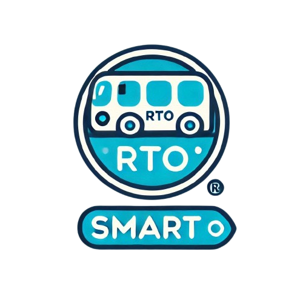

<p align="center">
  
</p>

<p align="center">
  
  
  
</p>

# SmartRTO

SmartRTO is a mobile application designed to streamline the processes related to road transport operations. It provides functionalities for officers to manage their profiles, handle service requests, and ensure efficient communication.

## Table of Contents

- [✨ Features](#features)
- [🛠️ Technologies Used](#technologies-used)
- [⚙️ Setup Instructions](#setup-instructions)
- [📱 Usage](#usage)
- [🤝 Contributing](#contributing)
- [📬 Contact](#contact)

## ✨ Features

- User authentication (sign up, login, logout)
- Profile management for officers
- Fetching officer data from Firestore
- Progress indicators for loading states
- Support for multiple languages (if applicable)

## 🛠️ Technologies Used

- **Flutter**: For building the UI.
- **Firebase**: For backend services like authentication and Firestore.
- **Dart**: Programming language used for Flutter development.

## ⚙️ Setup Instructions

1. **Clone the repository**:
    ```bash
    git clone https://github.com/yourusername/SmartRTO.git
    ```

2. **Navigate to the project directory**:
    ```bash
    cd SmartRTO
    ```

3. **Install dependencies**:
    ```bash
    flutter pub get
    ```

4. **Configure Firebase**:
   - Set up a Firebase project and add the necessary configurations to your app.
   - Add firebase.json, google-services.json to their desired folder
   - Ensure you have added the appropriate permissions in the Android and iOS configuration files.

5. **Run the application**:
    ```bash
    flutter run
    ```

## 📱 Usage

After setting up the application, you can create an account, log in, and manage your profile. The app allows you to interact with different functionalities related to road transport operations.

## 🤝 Contributing

Contributions are welcome! Please fork the repository and submit a pull request for any enhancements or bug fixes.

## 📬 Contact

For questions or support, contact:<br>
✉️ **Email:** bramha.deshmukh17@gmail.com
